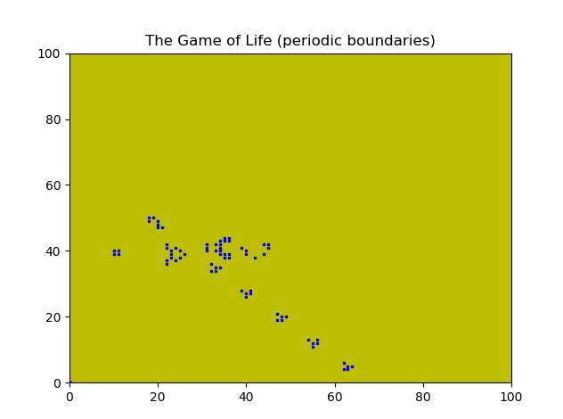
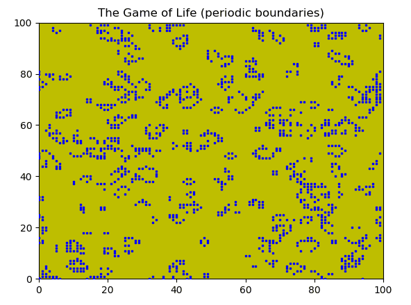

# GameofLife
This program respresents John Conway's Game of Life. The Game of Life is a 2d cellular automaton that is Turing complete.
The demos below show a random example of the classic Game of Life and hard coded example of Conway's Glider Guns, Gliders, and Eaters in action on a periodic grid.

